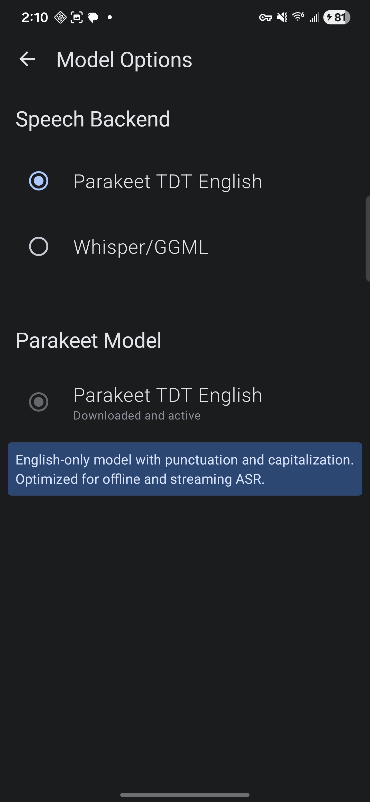

# FUTO Voice Input Moonshine

This personal fork keeps the FUTO voice keyboard experience and uses Moonshine v2 Streaming as its default offline recognizer. Choose the Small model for balanced speed and accuracy or Medium for higher accuracy. NVIDIA Parakeet TDT 0.6B V3 and the legacy FUTO Whisper/GGML backend remain selectable from Model Options.

This fork's Parakeet integration and repository changes were built with AI assistance using Codex (GPT-5).

The goal is straightforward: keep the FUTO UI and recording flow while adding responsive streaming transcription and personal vocabulary corrections.

## What Changed

- Moonshine v2 Small Streaming is the default balanced option and emits live partial transcripts.
- Moonshine v2 Medium Streaming is available as a higher-accuracy option.
- Parakeet and legacy Whisper/GGML remain selectable backends.
- Batch and streaming recognizers share backend-neutral Kotlin contracts.
- Personal vocabulary entries correct partial and final transcripts; use `heard => preferred` for explicit aliases.
- The stable app uses the distinct `org.futo.voiceinput.moonshine` package ID.
- Only the selected backend's model files are required before voice input starts.

## Screenshots

### Model Options



Moonshine is selected by default, with Parakeet and Whisper/GGML available as fallbacks.

## Active Model

The default backend and model are:

```text
Moonshine v2 Small Streaming English
```

The app downloads the selected quantized model assets from:

```text
https://download.moonshine.ai/model/small-streaming-en/quantized/
https://download.moonshine.ai/model/medium-streaming-en/quantized/
```

Model files are downloaded on first use rather than packaged into the APK.

After installing the APK, the model is downloaded by the app:

1. Open FUTO Voice Input Moonshine Settings.
2. Tap **Model**.
3. Select **Balanced** (Small) or **Higher accuracy** (Medium).
4. Confirm the download.

If you try voice input before downloading the model, the app prompts for the download. Transcription runs offline after installation.

Downloaded model files are stored in app-private storage:

```text
filesDir/moonshine-small-streaming-en/
filesDir/moonshine-medium-streaming-en/
```

Parakeet and Whisper/GGML models are also stored in app-private storage and run offline after download.

## Building Locally

Required tools:

- Android Studio or Android SDK command line tools
- JDK 17 or newer
- Android SDK platform 35
- Android NDK `28.2.13676358`
- Rust with `aarch64-linux-android` target
- `cargo-ndk`

Install the Rust target and cargo helper:

```powershell
rustup target add aarch64-linux-android
cargo install cargo-ndk
```

Create `local.properties` if Android Studio has not already created it:

```properties
sdk.dir=C\:\\Users\\User\\AppData\\Local\\Android\\Sdk
```

Build the debug APK:

```powershell
.\gradlew.bat :app:assembleDevDebug
```

If you need a development build that packages the Parakeet model into the APK, enable the bundled-model Gradle property:

```powershell
.\gradlew.bat :app:assembleDevDebug -PbundleParakeetModel=true
```

The APK is written to:

```text
app/build/outputs/apk/standalone/release/app-standalone-release.apk
```

## GitHub Releases

This repository includes a GitHub Actions workflow that builds an APK when a `v*` tag is pushed.

The first bundled-model Parakeet fork release was tagged as:

```text
v1.0.0-parakeet
```

To create a new release:

```bash
git tag v1.1.0-parakeet-runtime-download
git push origin master
git push origin v1.1.0-parakeet-runtime-download
```

GitHub Actions will:

- install Android build components
- install Rust and `cargo-ndk`
- build `:app:assembleStandaloneRelease`
- create a GitHub Release for the pushed tag
- attach the APK to that GitHub Release

You can also run the workflow manually from the Actions tab. Manual runs upload the APK as a workflow artifact but do not create a GitHub Release unless the run is for a tag.

## Notes

- First supported ABI is `arm64-v8a`.
- This is intended for sideloading and personal testing.
- The normal APK does not include speech model files.
- Moonshine emits live partial transcripts; Parakeet currently returns only a final transcript.
- The app requires network access to download the selected backend's model the first time, then transcription runs offline.

## Attribution And License

This fork is based on FUTO Voice Input and keeps FUTO's license and notices. FUTO Voice Input is licensed under the FUTO Source First License. Review [LICENSE.md](LICENSE.md) before distributing modified builds.

Parakeet model assets come from `istupakov/parakeet-tdt-0.6b-v3-onnx`, an ONNX conversion of NVIDIA Parakeet TDT 0.6B V3, licensed CC-BY-4.0.

This fork is not affiliated with or endorsed by FUTO.
