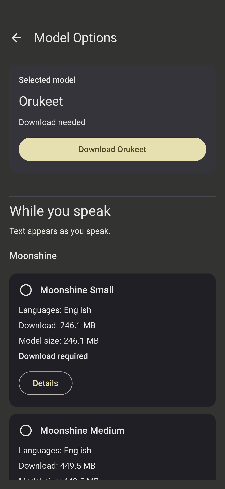

# FUTO Voice Input Moonshine

Offline voice typing for Android, with a choice of speech models, recoverable
recordings, personal dictionary corrections and optional local transcript cleanup.

  
  
   
  
  
  

This personal fork keeps [FUTO Voice Input](https://github.com/futo-org/voice-input)'s
voice keyboard and speech-recognition activity. Orukeet is the default recognizer.
Models download separately; recognition and cleanup then run on your phone.

[Download the APK](https://github.com/Today20092/voice-input/releases/latest) · [What differs from FUTO](#compared-with-original-futo-voice-input) · [Model guide](docs/model-guide.md) · [Release notes](docs/releases/v1.4.6.md) · [Report a problem](https://github.com/Today20092/voice-input/issues)

Stable [1.4.6](https://github.com/Today20092/voice-input/releases/tag/v1.4.6)
promotes the tested Share beta 7 code, with clearer Model Options, Parakeet Redux
and the Nemotron download fix.

Beta [1.4.7-beta.2](https://github.com/Today20092/voice-input/releases/tag/v1.4.7-beta.2)
adds ASR4ALL dictation, simpler cleanup settings, and a smaller voice-input panel.
Install the beta APK directly if you want to try these changes.

## Get started

1. Install the signed APK from [GitHub Releases](https://github.com/Today20092/voice-input/releases/latest).
   You need Android 8.0 or newer and an ARM64 device.
2. Open settings, grant microphone permission and follow the voice-input setup.
3. Open **Model Options**, keep Orukeet or choose a model, and download its files.
4. Select Voice Input Moonshine through your keyboard's voice-input control or
   Android's input-method picker, then try a short dictation.

The app uses `org.futo.voiceinput.moonshine`, separate from upstream FUTO Voice
Input. Install updates over the existing app to retain settings, models and
history. Do not uninstall or clear app storage.

  
  

Use **Check for updates** in settings or Obtainium for stable updates.
[Installation, updates and keyboard setup](docs/user-guide.md#get-started)
covers the details. This app is distributed through GitHub Releases and is not
listed in F-Droid's main repository.

## Compared with original FUTO Voice Input

This fork keeps FUTO's Android voice-input flow and adds:

- More recognition choices, with Orukeet as the default and streaming options
  for text while you speak.
- Recording history to copy transcripts and retry saved audio.
- Personal dictionary corrections, bulk paste and text-file imports.
- Optional local English cleanup with S1-mini by Superwhisper and Harper.
- A microphone waveform, an optional bottom-positioned popup and local diagnostics.

Upstream also develops multiple recognition models and streaming.
The [dated upstream comparison](docs/fork-background.md#comparison-with-futo-voice-input)
explains which versions were reviewed. Model choice and results depend on your
language and phone; we have no controlled benchmark establishing a universal
speed or accuracy advantage.

## Choose a model

Start with Orukeet. If you want text while speaking, choose a streaming model.
Try the same recording with different models before downloading several large ones.

| Your use | Starting option |
| --- | --- |
| Everyday dictation in a supported European language | Orukeet |
| Live English text | Moonshine Small |
| Live English text with built-in cleanup (1.4.7 beta) | ASR4ALL Small, Medium or Large |
| Live multilingual text | Nemotron 3.5 Multilingual |
| Arabic dictation | Cohere Transcribe with Arabic selected |
| Original FUTO recognition path | Legacy Whisper |

Model Options shows languages, download size, unpacked model size and readiness.
The screenshot was captured on a Samsung Galaxy S25 Ultra for beta 7; the
interface is unchanged in stable 1.4.6.

The [full model guide](docs/model-guide.md) includes all models, source links,
storage requirements and the other two screenshots. Download size and installed
model size are different from RAM use.

## Privacy and everyday use

Speech recognition and cleanup run locally after downloading their models.
Diagnostics stay local until you export and share a report yourself.

Recording backups are **on by default**, with 24-hour retention. They include
canceled and failed attempts. You can turn backups off, change retention or
delete recordings in settings. Uninstalling or clearing app data removes them.
[Audio history and recovery](docs/user-guide.md#audio-history-and-recovery)
explains the controls.

Personal Dictionary applies explicit text corrections. S1-mini provides optional
English rewriting after recognition and is off by default. Turn it off for
non-English dictation on models that cannot report a language.
[Dictionary and cleanup instructions](docs/user-guide.md#personal-dictionary-and-cleanup)
cover imports, language handling and Harper settings.

## Known limits and help

The maintainer uses a Samsung Galaxy S25 Ultra. Testing on that phone does not
establish compatibility with every phone, model, keyboard or headset.

- The dedicated FUTO Keyboard provider setup entry is hidden in 1.4.6 pending
  upstream support. See [keyboard setup](docs/user-guide.md#keyboard-setup).
- Redux Android inference and comparative model benchmarks still need device
  validation.
- The [Poco no-speech report](https://github.com/Today20092/voice-input/issues/8)
  remains unresolved.

For a bug, include the app version, phone/Android version, model, keyboard or
editor, reproduction steps and what happened.
[Export a diagnostic report](docs/diagnostics.md) if useful, and review it before
sharing. Do not attach private audio or transcripts unintentionally.

The [release notes](docs/releases/v1.4.6.md) record verification and remaining
limits. [GitHub Issues](https://github.com/Today20092/voice-input/issues) tracks
bugs and planned work.

## Why this fork exists

I like FUTO Voice Input's interface and wanted to keep it while experimenting
with other local speech models. Orukeet and Cohere have worked well in my
everyday use. I test changes on my phone and welcome
[feature ideas and device reports](https://github.com/Today20092/voice-input/issues).

**The code changes for this fork are written by AI agents, directed by me.**
I choose the work, test the app and provide feedback. AI tools are used in
development; dictation uses the local models described above.
[Project background and AI disclosure](docs/fork-background.md)
explains the workflow and preserves upstream and third-party attribution.

## Documentation and contributing

- [User guide](docs/user-guide.md): installation, keyboards, history, dictionary,
  cleanup, popup and diagnostics.
- [Model guide](docs/model-guide.md): model catalog, downloads and screenshots.
- [Development guide](docs/development.md): builds, contributions and releases.
- [Fork background](docs/fork-background.md): upstream comparison, project history,
  AI development and attribution.
- [Phone testing procedure](docs/phone-performance-test.md): collect comparable
  measurements on your device.

This fork preserves the [FUTO Source First license](LICENSE.md) and notices.
It is not affiliated with or endorsed by FUTO. Model weights and runtimes have
their own terms; see [attribution and licenses](docs/fork-background.md#attribution-and-licenses).
