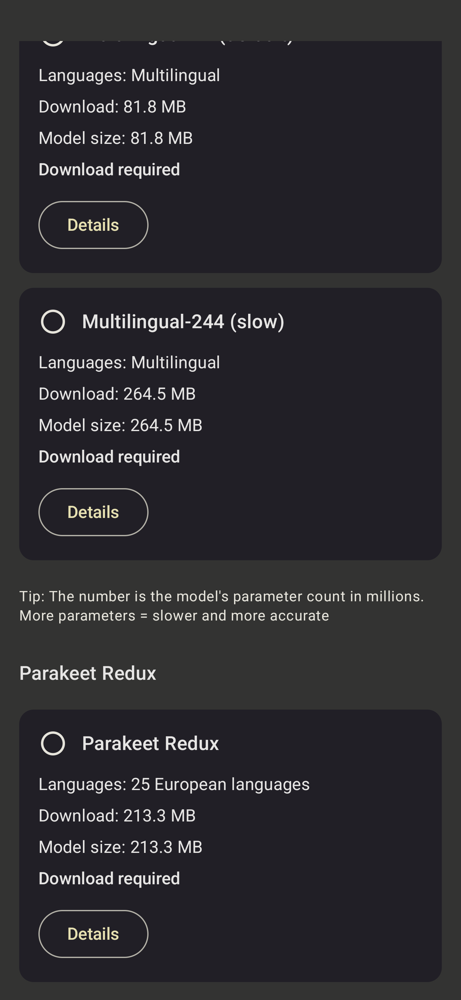
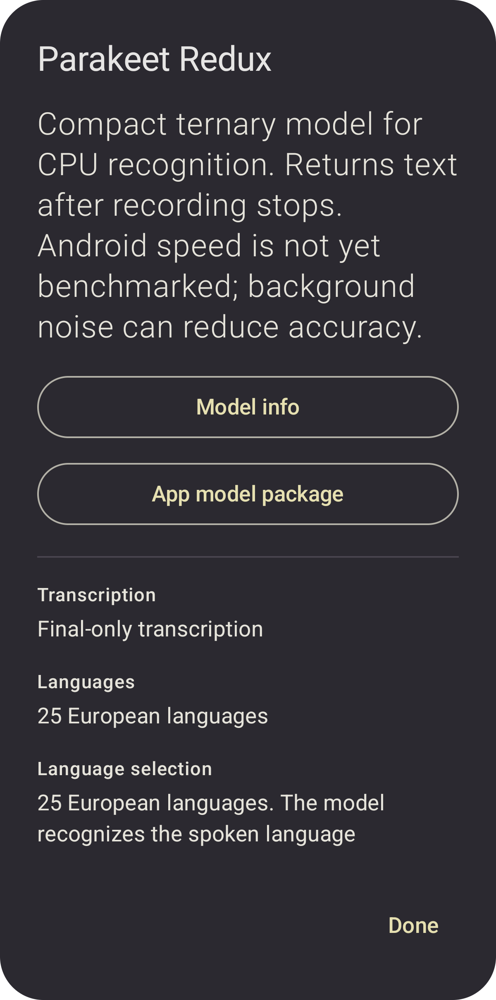

# Model guide

[Back to the README](../README.md)

Start with **Orukeet**, the default. For words while speaking, choose a streaming model. Compare the same short recording on your phone before downloading several large models.

## Model Options screenshots

The current interface shows the selected model, groups models by when text
appears, and lists download and unpacked model sizes. Details link to model
information and the package used by the app.

Captured on a Samsung Galaxy S25 Ultra running Android 16 for beta 7, whose
interface is unchanged in stable 1.4.6. Model size means unpacked files on disk,
not RAM used during transcription.

## Compare models

Development builds also include **ASR4ALL Small, Medium and Large** for live
English dictation. They add punctuation, capital letters and small corrections
with built-in PCEC, so S1-mini is skipped for these models. Downloads are about
38.6, 72.5 and 123.1 MB. All three use the low-latency `c16r4` streaming tier;
Plus models are omitted because their extra speaker features do not help this
dictation flow. See the [implementation and S25 Ultra test report](research/ticket-26-asr4all-feasibility-2026-10-09.md)
for pinned sources, timings and test limits.

| What you want | Try first | Next option |
| --- | --- | --- |
| Everyday dictation in a supported European language | Orukeet | Parakeet TDT V3 |
| Live English text with a lighter model | Moonshine Small | Moonshine Medium, then Nemotron English |
| Live multilingual text | Nemotron 3.5 Multilingual | Orukeet if final-only text is acceptable |
| Arabic dictation | Cohere Transcribe with Arabic selected | Whisper multilingual |
| A smaller multilingual download to experiment with | Parakeet Redux | Orukeet; Redux still needs Android device validation |
| The original FUTO recognition path | Whisper | A model matching your language and live-text needs above |

We keep several models because language coverage, live text, download size and recognition results differ. Alternatives let you find one that suits your speech and phone; Whisper preserves the original FUTO path. S1-mini is optional English text cleanup after recognition, a separate choice from the speech model. This guide is a starting point, not a phone benchmark or an accuracy ranking.

These are the options exposed by this app, not every capability of the upstream models. The use cases describe intended trade-offs, not a measured ranking across Android devices.

| Model | Languages in the app | Text appears | Purpose and trade-off | Model source |
| --- | --- | --- | --- | --- |
| **Orukeet · default** | 25 European languages | After Stop | Starting point for everyday dictation. A Parakeet-derived model with multilingual and accent-focused adaptation; no live partials. | [Oruk AI](https://huggingface.co/oruk/orukeet) |
| **Parakeet Redux** | 25 European languages | After Stop | Compact packed ternary CPU model, about 213 MB. Android speed is unmeasured; publisher results show a noise-accuracy trade-off. | [Moondream](https://huggingface.co/moondream/parakeet-redux) · [packed GGUF](https://huggingface.co/mudler/parakeet-cpp-gguf) |
| **Moonshine Small** | English | Live | Lighter English streaming option when resource use matters. | [Moonshine AI](https://github.com/moonshine-ai/moonshine) |
| **Moonshine Medium** | English | Live | Larger English streaming option intended to favor accuracy, with greater resource use than Small. | [Moonshine AI](https://github.com/moonshine-ai/moonshine) |
| **Parakeet TDT 0.6B V3** | 25 European languages | After Stop | NVIDIA's multilingual alternative to Orukeet, useful for comparing results on your own speech. | [NVIDIA](https://huggingface.co/nvidia/parakeet-tdt-0.6b-v3) · [INT8 export](https://huggingface.co/twmht/sherpa-onnx-nemo-parakeet-tdt-0.6b-v3-int8) |
| **Parakeet Unified EN 0.6B** | English | Buffered live | Recomputes recent context for live updates. More work per update than a recognizer that reuses cached streaming state. | [Sherpa-ONNX export](https://huggingface.co/csukuangfj2/sherpa-onnx-nemo-parakeet-unified-en-0.6b-int8-streaming-560ms) |
| **Nemotron English** | English | Live | Choose Low latency, Balanced, or Accuracy profiles to trade update frequency against recognition context. | [NVIDIA](https://huggingface.co/nvidia/nemotron-speech-streaming-en-0.6b) · [Sherpa-ONNX packages](https://github.com/k2-fsa/sherpa-onnx/releases/tag/asr-models) |
| **Nemotron 3.5 Multilingual** | 28 languages, with Auto-detect | Live | Multilingual streaming with explicit language selection or automatic detection. | [Sherpa-ONNX export](https://huggingface.co/csukuangfj2/sherpa-onnx-nemotron-3.5-asr-streaming-0.6b-560ms-int8-2026-06-11) |
| **Cohere Transcribe** | 14 languages, including Arabic and English | After Stop | Another multilingual option, particularly for Arabic. Explicit language selection; a large download and substantial memory use. | [Cohere Labs](https://huggingface.co/CohereLabs/cohere-transcribe-03-2026) · [INT8 export](https://huggingface.co/csukuangfj2/sherpa-onnx-cohere-transcribe-14-lang-int8-2026-04-01) |
| **Whisper · legacy** | English and multilingual options | Final after Stop; legacy decode progress may show partials | Preserves FUTO's original Whisper/GGML path as a fallback and comparison option. | [FUTO source and model integration](https://github.com/futo-org/voice-input) |
| **S1-mini by Superwhisper** | English text | After recognition | Optional transcript cleanup, not speech recognition. Adds processing time to improve the presentation of dictated text. | [Superwhisper GGUF](https://huggingface.co/superwhisper/s1-mini-GGUF) |

Nemotron English's 80, 160, and 560 ms profile values describe audio chunks, not guaranteed end-to-end latency. Phone hardware, recording length, language, and model all affect results. Publisher benchmarks are not measurements of this Android app.

See the [Redux, Ultra, and Orukeet comparison](parakeet-redux-comparison.md) for published accuracy, CPU measurements, storage, and their limits. Redux uses a pinned MIT parakeet.cpp runtime and converted CC BY 4.0 weights by Moondream, derived from NVIDIA Parakeet. Ultra is compared there but is not an app option.

Cohere download and recognition, history improvements, and the popup were manually tried on a Samsung Galaxy S25 Ultra. No comparative speed, memory, or accuracy benchmark was collected. Cohere has no automatic language detection, and mixed-language dictation can be inaccurate.

## Model downloads

Models download separately into app-private storage. The normal APK does not bundle weights. Network access is needed for the initial download; recognition then works offline. S1-mini is a separate optional download.

- **Orukeet:** about 487 MB to download and 672 MB installed. Allow about 1.16 GB free during installation for the archive and extracted files. Interrupted downloads can resume when the server supports byte ranges.
- **Parakeet Redux:** about 213 MB to download and install, using a revision-pinned packed GGUF with SHA-256 verification. ARM dot-product support enables its NEON kernel; older ARM64 CPUs use a slower scalar fallback.
- **Cohere:** about 2.89 GB of model files, plus working memory during recognition. Longer recordings use chunks of up to 35 seconds; words near boundaries may need checking.
- **S1-mini:** about 484.2 MB for the pinned Q4_K_M model.
- **Moonshine:** quantized assets come directly from Moonshine AI's [Small](https://download.moonshine.ai/model/small-streaming-en/quantized/streaming_config.json) and [Medium](https://download.moonshine.ai/model/medium-streaming-en/quantized/streaming_config.json) download service.

The [model catalog](../app/src/main/java/org/futo/voiceinput/recognition/RecognitionModelCatalog.kt) records the app's selected packages and revisions. Linked model pages may describe newer upstream versions than the app downloads.
